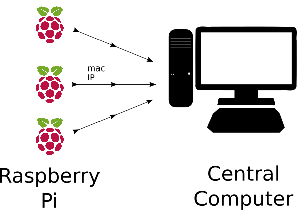

## DOCS

This document aims to capture general procedures for the homecage_quantification project.


## FED3 

> We are using FED3 devices to deliver food and quantify intake in the homecage

### What is a FED?

FED3 are devices were created by Lex Kravitz. If you want to buid one from scratch, [here's the list of materials](https://hackaday.io/project/106885-feeding-experimentation-device-3-fed3#menu-components).

Luckily, you can get the electronics from Open Ephys Production site. Link [here](https://open-ephys.org/fed3).

For now, you have to 3D print yourself. Printer quality is important for mechanical devices, it takes around one day to print one. 

> As of March 2020, Open Ephys is working on finding a 3D printing partner. To be updated.

### FED3 Setup

On the heart of the FED3 devices, there's an Adafruit M0 board. This means you will be using the Arduino IDE for managing code and communicating with the device. Carefully follow the instructions on the hackaday page (link below).

You can find all the relevant information [here](https://hackaday.io/project/106885/instructions)

### FED3 Usage

Please check the videos for FED device on YouTube

* [Building device](https://hackaday.io/project/106885-feeding-experimentation-device-3-fed3/log/157363-fed-build-video#discussion-list)
* [Basic Usage](https://youtu.be/VvVrZ950hvQ)

### FED3 Data Analysis

You can use [this tool](github.com/matiasandina/FED_quantification) for data analysis.

### Caution

#### Batteries

FED3 devices are powered by batteries that take quite a long time to refill. Although they last for a bit more than a week during operation, they can take up to **2 days** to fully charge. 

The current solution is to have extra batteries charged. It's a good idea to have extra [battery packs](https://www.adafruit.com/product/354) charging with [this charger](https://www.adafruit.com/product/1304). Just swap them on the device when they get low.


#### Setting the time

FED3 devices ship with a real time clock that needs to be set to a proper time.

To flash/upload sketches, put the Adalogger it into "bootloader" by doing a "double-clicking" on the little reset button on the board. When it is ready to accept code, the red LED on the Adalogger should "breathe" like this:
https://www.youtube.com/watch?v=-Ce02eltnIw

I tried to upload sketches in my Ubuntu machine but failed (even though the ports showed the feather m0 board, uploading code yielded "device not found"). I suspect that it has to do with root permissions but I didn't want to struggle for too long with it to find out.

Luckily I had a Windows machine available, so I:

> Installed fresh arduino IDE 1.8
> copied the libraries (following install guide on hackaday)
> Configured additional boards manager on Preferences (link to https://adafruit.github.io/arduino-board-index/package_adafruit_index.json)
> Installed Adafruit SAMD board 1.5.5 (following install guide on hackaday and recent issues)
> Java 8 (this machine didn't have Java and the first iteration returned a java error)

Uploaded the sketches with no problem. Clock updated, FED3 back to work. Your clock should be good to go until the next daylight savings time messes with your data or the clock's battery dies, whichever comes first! 


### FED3: read more

Your questions will be probably answered if you visit these sites or contact these people. 

* Request access to the FED3 google groups. Group link [here](https://groups.google.com/forum/#!forum/fedforum)

* [Hackaday page for this device](https://hackaday.io/project/106885/instructions)

* [Open Ephys production site](https://open-ephys.org/fed3)

* Lex Kravitz

## Activity tracking

> We are tracking activity using optic flow estimation and tossing all video. 

Why?

1. It gets the job done (general activity estimate).
1. It's computationally inexpensive. As of 2020, DeepLabCut is still computationally expensive, we can't run it real time on a raspberry Pi 4.

### Rapsberry Pi

We gain access to the raspberries through the local network (either ssh or vnc). You can find VNC Viewer [here]. If you are trying to use VNC viewer from an Android device, you can find it on the play store.

Our aim is to setup the raspberries in a way that allows us to  Every raspberry is scheduled 



### How to run an experiment

The main script to control the cameras, run optic flow, and stream via IP is called `main.py`.

### Video stream

It is possible to stream to a local network to be visualized by other computers in the network (via IP). To accomplish this, proper setup is needed. Mainly:

1. A raspberry Pi that was configured using `setup.sh` and will thus send MAC and IP address every minute to the central computer.
1. A "central" computer with static IP, henceforth "cohilab computer".
1. A folder on choilab computer with the proper information for each raspberry (MAC address and IP).
1. The `raspberry_IP/update_pi_info.py` script on the choilab computer. 

To visualize the stream:

1. Open a terminal (<kbd>Ctrl</kbd> + <kbd>Alt</kbd> + <kbd>T</kbd>)
1. Navigate to the proper folder (`cd Raspberry_IP/`)
1. Run the python script `python3 update_pi_info.py`

This will open many browser. You will be prompted for username and password.

> In principle, any computer connected to the network can check the stream from a web browser. It will need IPs to do so (found on the `raspberry_IP` folder).


### Record video to local file. 

It might be necessary to record. For this, the `main.py` script allows you to change the recording specifically on the camera object.


## Raspbian install


## Remote connection to raspberry Pi

If you followed the installation properly, the raspberry should accept ssh and the choilab computer should have keys to do ssh. You can ssh into any raspberry pi doing: 

```
ssh pi@ip_address
```

This will give you access to the terminal but you will not be able to visualize anything going on.

> If you have a keyboard/monitor connected to the Pi, you can use VNC viewer to do remote control. 